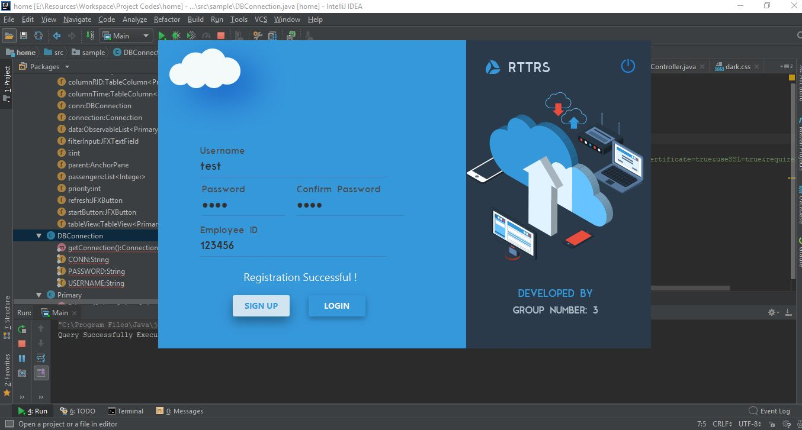
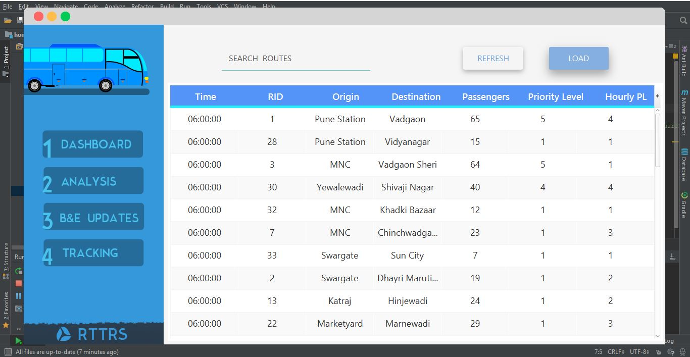
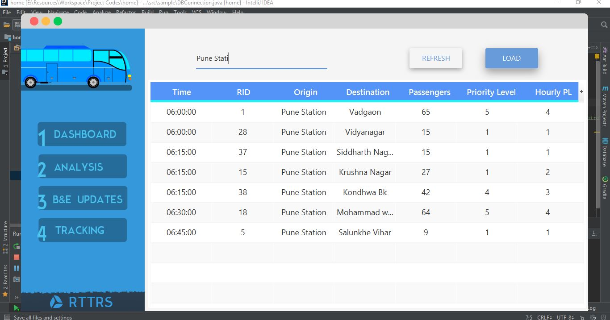
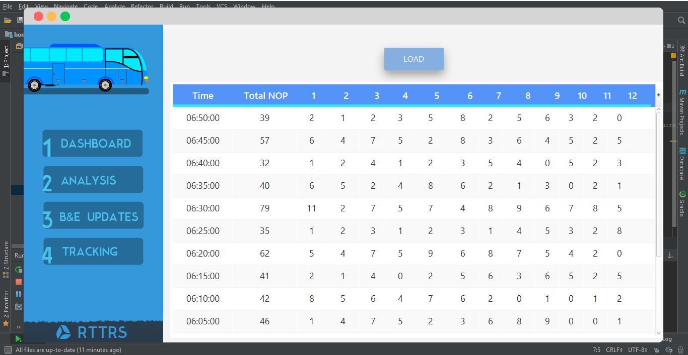
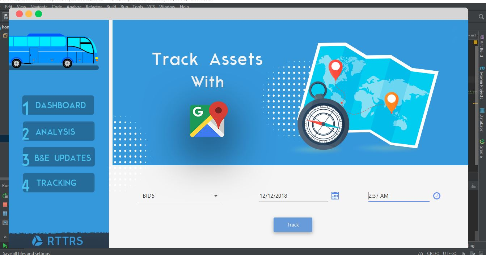
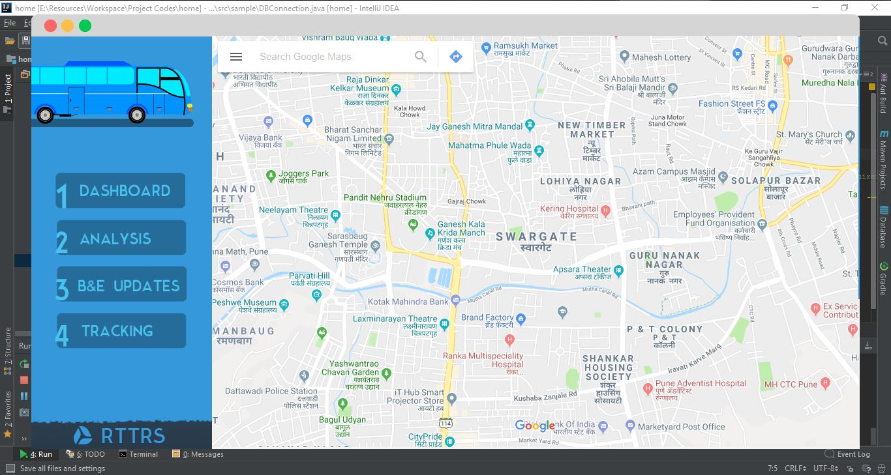

# Real Time Transit Redirection System (RTTRS)

**Technologies Used:** 
Software - Java, JavaFx, MySQL, Embedded C, GCP.
Hardware - ARM7 Microcontrollers, ESP8266 nodemcu, SIM808 Module, PIR Motion Sensors, GLCD.

Every day, millions of people rely on public transport systems to travel which are managed by government. It is cost efficient way to commute, but a highly unreliable one. More often than not, buses are packed on some routes, while are empty on others.  Aim of this project is to change this scenario by making use of analytics. This system takes into account the number of people travelling on a particular route and then assigns priority to routes accordingly. Different algorithms are used to address density of commuters on the route. 

 Real-Time Transit Redirection System consists of four important components which are interconnected. These components are:

1)	Java based Desktop Client.
2)	Standalone Microcontroller devices installed on Bus.
3)	Interconnected Microcontroller Units installed on Bus-Stops.
4)	Centralized Database for Storing Information (Google Cloud Platform) .
 
 All of these units are automated in their functions and provide data directly to client application platform. This data will be further processed by use of algorithms and will directly provide actionable insights.

# System Components 

**Java based Desktop Client**: Java generates bytecode files that are platform independent and hence is the obvious choice for the Application language. An application interface has been created on java platform that pulls the data uploaded to MySQL server by Bus Microcontroller Units and processes it with the help of algorithms. It evaluates density of commuters and assigns proper priorities to different bus routes. It also has a section for emergencies such as vehicle breakdown or accidents. In such circumstances, action can be taken promptly without any further delay.

**Standalone Microcntroller devices installed on Bus**: An ARM7 based system is installed on each bus that has communication capability and uploads data to the MySQL server with the help of ESP8266. It also has provisions to perform some additional functions. These functions include sending current location to the server, relaying messages in case of breakdown or emergency, notifying central server of extreme traffic congestion.

**Interconnected Microcontroller Units installed on Bus-Stops**: Another unit with ARM7 Microcontroller is installed on each bus stop. Its main functionality is to count the number of passengers waiting on the bus stops. This unit makes use of Nodemcu to connect with central database. In additions, it will also relay the destination of passengers. This data uploaded to database is further processed by Java Application to extract meaningful information.
 

**Centralized Database for Storing Information**: A MySQL Database is in charge of storing data received from microcontrollers installed on buses and bus stops. Google Cloud Platform(GCP) is being used for storing SQL Instance. Each microcontroller has a pre-defined database table assigned to it. This data also acts as historic data in the future. MySQL has relational database structure which allows us to store information in tabular form. Secure Socket Layer (SSL) is being used for Encryption for transferred data. 

# Cloud Based Authentication & Registration

# Dashboard

# Bus Route Search

# Analysis (Individual Bus Stops)

# Track Assets (Exact Bus Locations)

# Integrated Google Maps

# Credits

**Libraries Used:**

1) GMapsFX (Google Maps Library)
2) JFoenix (Material Design)
3) Freepik (Icons)

**Created by: Bhagwan Sanjay Deore**
# Thank You!
